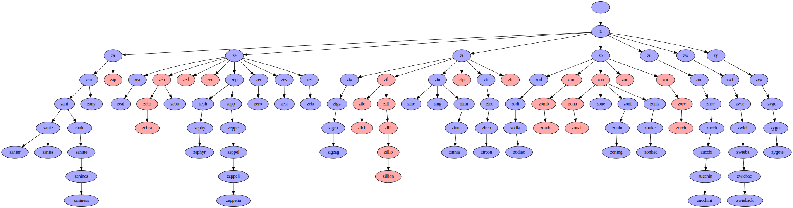

# Ghost solver

This is a repo for a small script which visualizes the game tree for the
word game [Ghost](https://en.wikipedia.org/wiki/Ghost_(game)), in which
players alternate adding letters to a word, where the first player to
create a valid word loses.

Invoke the script like so:

```bash
$ cat your_word_list.txt | ./ghost.py | dot -Tsvg -ooutput.svg
```

That will output the game tree for your word list to `output.svg`. Nodes
that are blue are wins for the first player (assuming perfect play) and
nodes which are red are wins for the second player (also assuming perfect
play).

## Example tree
Here is a sample tree for words beginning with the letter z:


